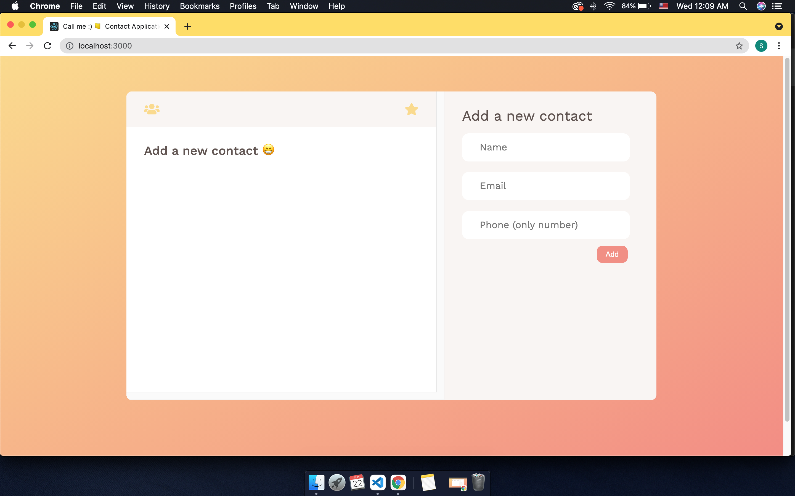
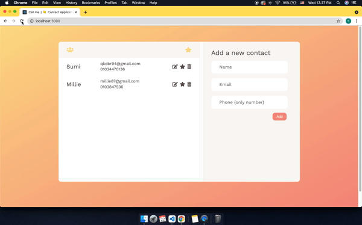
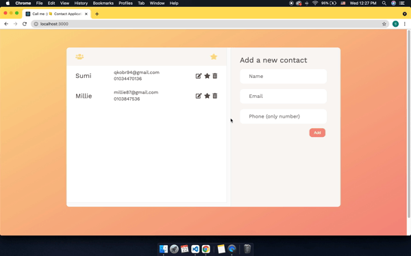

# 📒 Contacts application

## 📝 About Details

1. User can add a new contact(name, email are required but phone is optional).
2. The form checks if user input fields are valid.
3. User can **add** a contact to favorite lists and also remove the contact from favorite lists by toggling "star" button.
4. User can **edi**t a contact(name, email and phone).
5. User can **remove** a contact from lists.
6. All of user experiences are stored in **localstroage** which can keep track of user action in this application.
7. Contact list and Favorite list are built with **React Router**.

 

---

## ⭐️ Add a new contact

### Whenever user puts valid input, the new contact will be added on the _contact lists_.

- Name input will be organized (First letter:uppercase, the rests: lowercase.)

- Email input field will be filtered by **REGEX**. When it is not valid, the input border changes in red line.

- Phone field is optional. When user does not put "number", the border changes in red line.

   

---

## ⭐️ Add a contact fo Favorite lists

### When user clicks the _Star button_, user can add the contact to Favorite list, and remove from the favorite list by simply toggling button.

- By clicking button, the contact will be on the favorite list.

- On the favorite list, user can put it back to Contact list.

   

---

## ⭐️ Edit a contact

### When user clicks the _Edit button_, user can edit name, email and phone fields.

- When user edits the contact information, same input validation will be triggered.

- User can close the edit container with three ways: by clicking **X** button, by pressing **Esacape** key and also by clicking **body** (outside of edit container).

   

---

## ⭐️ Remove a contact

### User can delete the contact information.

- User can delete contact information by clicking the **remove button**

- When user clicks the button, the contact information is also deleted from local storage.

   

---

## ⭐️ User experiences are saved in localstorage

### All user experiences(add, edit, add to favorite lists and remove contact) are saved in localstorage.

- When user revisits the site, localstorage can keep track of prvious user actions.

   

---

## ⭐️ React router: contact list/favorite list

### Contact application is **single page web application**.
